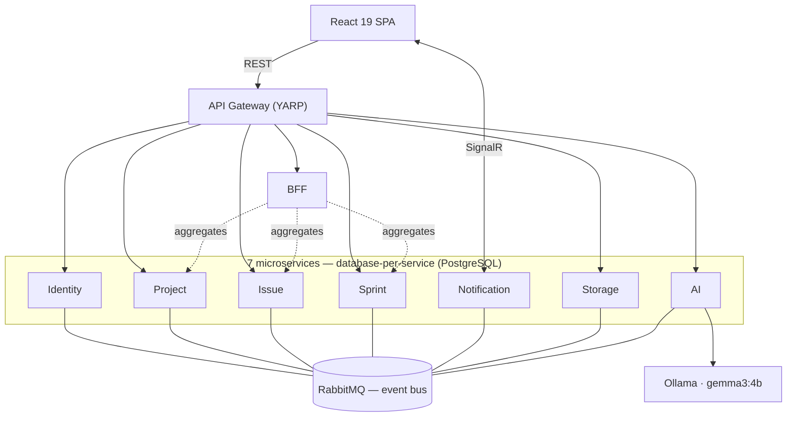

# Flowgent

**An AI-assisted, microservice-based, event-driven project & task management platform** — a fully-inspectable reference implementation of the distributed-systems patterns behind tools like Jira and Linear, enriched with a locally-hosted LLM.


---

## Overview

Flowgent lets software teams run project and task management end to end — organizations, projects, issues, a drag-and-drop Kanban board, sprint planning, real-time notifications, secure file uploads, and an AI assistant that turns a natural-language project description into a concrete sprint & task plan.

The point of the project isn't just the features — it's to implement, in a way you can actually read, the engineering patterns that appear once a system is genuinely distributed: keeping data consistent across services **without a shared database or two-phase commit**, delivering events reliably even when a service is temporarily down, and separating read/write concerns cleanly. On top of that, the AI runs **fully on-prem**, so no project data leaves the environment.

---

## Architecture

Seven independent .NET 9 microservices, each owning its own PostgreSQL database (**database-per-service**), behind a **YARP API Gateway** and a **BFF** layer. Services never call each other's databases — they share state only by publishing and consuming events over **RabbitMQ**. Reads and writes are separated with **CQRS** (via MediatR), each service follows **Clean Architecture**, and cross-service consistency is achieved through the **Transactional Outbox / Inbox** patterns and **eventual consistency**.



### Services

| Service | Port | Responsibility |
| --- | --- | --- |
| **API Gateway** | 5000 | YARP reverse proxy — JWT validation, CORS, routing, correlation ID |
| **Identity** | 5001 | Authentication, authorization, users / roles / refresh tokens |
| **Project** | 5002 | Projects, teams & membership, project-summary read model |
| **Issue** | 5003 | Issue CRUD, comments, attachments, status-transition engine, Kanban read model |
| **Sprint** | 5004 | Sprint planning, backlog, velocity, carry-over policy |
| **Notification** | 5005 | Notification generation, delivery, real-time push via SignalR |
| **BFF** | 5006 | Aggregates multi-service data into frontend-shaped responses |
| **Storage** | 5007 | Two-phase file upload, persistence, orphan cleanup |
| **AI** | 5008 | LLM-based plan generation, task enrichment, project querying |

### Event-driven communication

Services publish domain events to a durable **topic exchange** on RabbitMQ; interested services consume them **idempotently**. Main events:

| Event | Publisher | Consumers |
| --- | --- | --- |
| `IssueCreatedEvent` | Issue | Project, Sprint, Notification |
| `IssueStatusChangedEvent` | Issue | Project, Sprint, Notification |
| `IssueAssignedEvent` | Issue | Project, Notification |
| `CommentAddedEvent` | Issue | Notification |
| `SprintStartedEvent` | Sprint | Project |
| `SprintCompletedEvent` | Sprint | Project, Issue, AI |
| `MemberAddedEvent` | Project | Notification |

### Patterns & guarantees

- **Transactional Outbox** — a service never writes to RabbitMQ directly. The business change and the outgoing event are persisted in the **same DB transaction** (`OutboxMessages`). A background `OutboxPublisherService` claims pending events in batches with an optimistic lock, publishes them, and marks them sent; failures are retried with exponential backoff (10s → 30s → 60s → 120s → 300s) and dead-lettered after five attempts.
- **Inbox / idempotency** — every processed event ID is stored in `ProcessedEvents`, so at-least-once redelivery never causes double processing. Outbox + Inbox together give **effectively-once** processing.
- **CQRS (MediatR)** — commands and queries use separate models; e.g. the Kanban board reads from a denormalized read model kept in sync by consuming issue events.
- **Clean Architecture** — each service is split into Api / Application / Domain / Infrastructure with dependencies pointing only inward; the Domain layer has no infrastructure dependencies.
- **Database-per-service** — every service owns its schema; no cross-database access.
- **Optimistic locking** — concurrent updates are guarded with a `Version` field and `If-Match` / ETag conditional requests.
- **Observability** — structured logging with Serilog aggregated in **Seq**; a **correlation ID** flows through every request and event, so a distributed operation can be traced end to end in one query.

---

## AI assistant

The AI service integrates **gemma3:4b** running locally on **Ollama** — project data is processed on-prem, never sent to an external cloud API. Capabilities:

- **Plan generation** — turns a natural-language project description into a structured sprint & task plan (JSON), validated against a schema, then saved to the Sprint and Issue services.
- **Task enrichment** — expands a short issue title into a description with acceptance criteria.
- **Project querying** — answers questions over project data via a chat interface, using **context injection** into the prompt (a lightweight alternative to a full RAG pipeline).
- **Auto retrospective** — consumes `SprintCompletedEvent` to generate a retrospective summary.
- **Reliability** — if the model returns invalid JSON, it falls back to `llama3.2:3b` and re-validates against the schema.

---

## Tech stack

**Backend**

| Technology | Version | Purpose |
| --- | --- | --- |
| .NET / ASP.NET Core | 9.0 | Microservice runtime |
| Entity Framework Core | 9.0 | ORM, code-first migrations |
| PostgreSQL | 16 | One relational database per service |
| MediatR | 14.0 | CQRS command/query pipeline |
| FluentValidation | 12.1 | Command & query validation |
| AutoMapper | 16.0 | Entity → DTO mapping |
| RabbitMQ | 3.13 | Async event-driven messaging (AMQP) |
| Redis | 7 | Distributed cache infrastructure |
| YARP | — | API gateway / reverse proxy |
| SignalR | — | Real-time WebSocket notifications |
| Serilog + Seq | — | Structured logging & central log management |

**Frontend**

| Technology | Version | Purpose |
| --- | --- | --- |
| React | 19.2 | Component-based UI |
| TypeScript | 5.9 | Type-safe development |
| Vite | 7.3 | Dev server & bundler |
| Zustand | 5.0 | Global state (auth, theme) |
| TanStack Query | 5.90 | Server-state caching |
| Axios | 1.13 | HTTP client |
| @microsoft/signalr | 10.0 | Real-time connection |
| @dnd-kit | — | Kanban drag & drop |

---

## Security

- **JWT (HS256)** access token, 60-minute lifetime, carried in an **HttpOnly cookie** (XSS-resistant).
- **Refresh tokens** SHA-256 hashed at rest, 30-day lifetime, **rotated** on every refresh.
- Passwords hashed with **Bcrypt**.
- **SecurityStamp** invalidation — changing password/role/status invalidates all existing tokens.
- **Account lockout** for 15 minutes after five failed logins.
- Every endpoint is authorized and pre-validated at the gateway; authorization combines a system role with an org-level role (Owner / Lead / Member).

---

## Running locally

**Prerequisites:** Docker & Docker Compose, and [Ollama](https://ollama.com) with the model pulled (`ollama pull gemma3:4b`).

```bash
git clone https://github.com/metinkaryagdi/Flowgent.git
cd Flowgent
docker compose up -d
```

Services come up behind health checks. Ports: Gateway 5000 · Identity 5001 · Project 5002 · Issue 5003 · Sprint 5004 · Notification 5005 · BFF 5006 · Storage 5007 · AI 5008. Infra: RabbitMQ 5672 (UI 15672) · Redis 6379 · Seq 5341 · frontend 5173.

> Adjust paths/commands to match your repository layout.

---

## Testing

Each service has its own unit-test project (command/query handlers, FluentValidation rules, domain behavior, event consumers, middleware). The full flow is additionally verified with end-to-end scenario tests and Docker Compose integration tests — including stopping a service mid-flow and confirming events wait in the queue and are processed with no data loss once it recovers.

---

## Roadmap

- [ ] Deploy on **Kubernetes** with horizontal autoscaling and a service mesh
- [ ] Activate **Redis** as a read cache for hot queries
- [ ] Add **OpenTelemetry** distributed tracing & metrics
- [ ] Extend the AI assistant to a full **RAG** pipeline (vector DB)
- [ ] Multi-tenant architecture and a mobile client
- [ ] CI/CD pipeline with automated security scanning

---

*Built by [Metin Karyağdı](https://github.com/metinkaryagdi) as a B.Sc. graduation project, Amasya University, 2026.*
