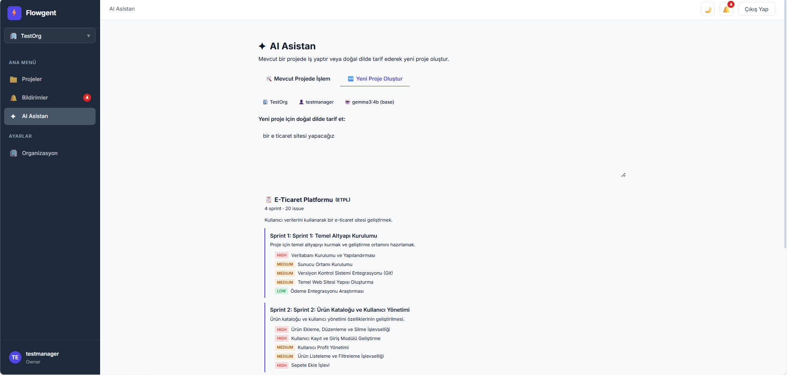
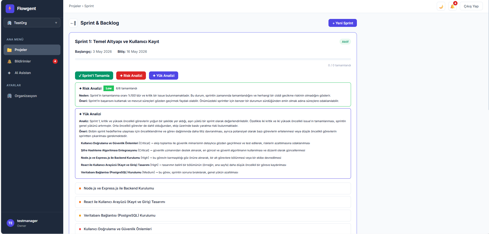
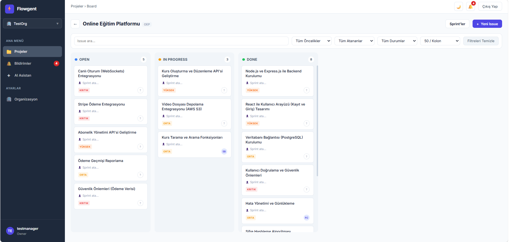
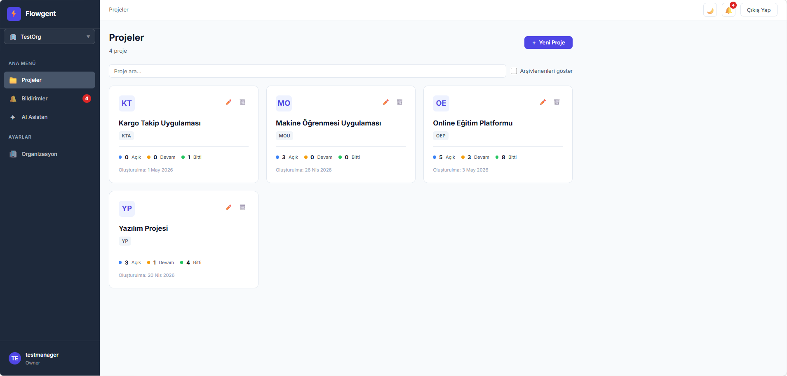
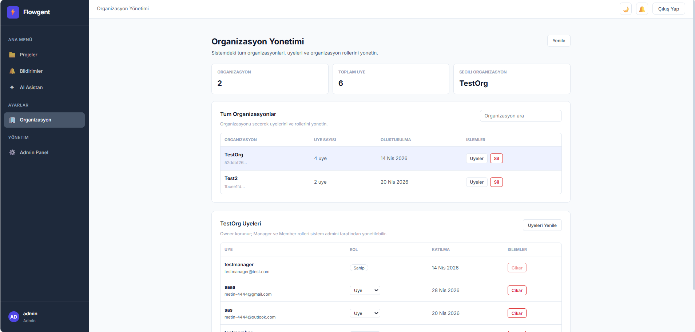
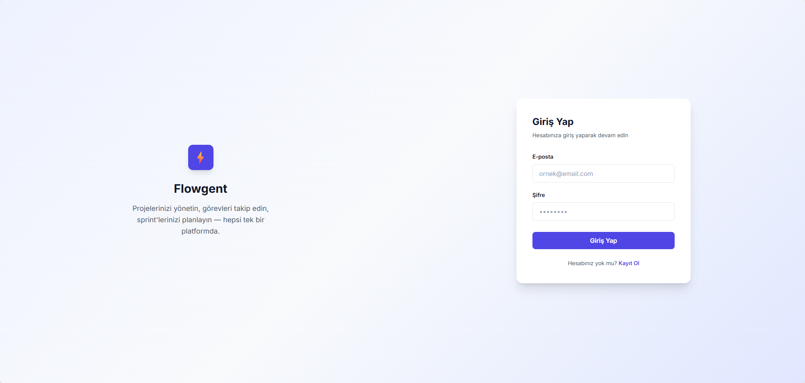
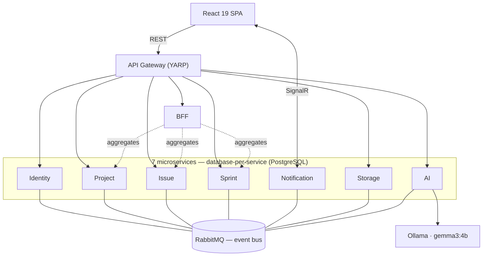

# Flowgent

**An AI-assisted, microservice-based, event-driven project & task management platform** — a from-scratch, fully-inspectable implementation of the distributed-systems patterns behind tools like Jira and Linear, enriched with a locally-hosted LLM.


[](https://github.com/metinkaryagdi/Flowgent/actions/workflows/ci.yml)

---

## Overview

Flowgent lets software teams run project and task management end to end — organizations, projects, issues, a drag-and-drop Kanban board, sprint planning, real-time notifications, secure file uploads, and an AI assistant that turns a natural-language project description into a concrete sprint & task plan.

The point of the project isn't just the features — it's to implement, in a way you can actually read, the engineering patterns that appear once a system is genuinely distributed: keeping data consistent across services **without a shared database or two-phase commit**, delivering events reliably even when a service is temporarily down, and separating read/write concerns cleanly. On top of that, the AI runs **fully on-prem**, so no project data leaves the environment.

---

## Screenshots

**AI assistant — natural language in, a full sprint & task plan out.** Typing *"bir e-ticaret sitesi yapacağız"* produces a 4-sprint / 20-issue plan with priorities, which is then persisted to the Sprint and Issue services.

| AI plan generation | AI sprint risk & workload analysis |
| --- | --- |
|  |  |

| Kanban board | Projects overview |
| --- | --- |
|  |  |

| Organization & role management | Sign in |
| --- | --- |
|  |  |

> The UI is currently Turkish-only; localisation is on the roadmap.

---

## Architecture

Seven independent .NET 9 microservices, each owning its own PostgreSQL database (**database-per-service**), behind a **YARP API Gateway** and a **BFF** layer. Services never call each other's databases — they share state only by publishing and consuming events over **RabbitMQ**. Reads and writes are separated with **CQRS** (via MediatR), each service follows **Clean Architecture**, and cross-service consistency is achieved through the **Transactional Outbox / Inbox** patterns and **eventual consistency**.


```mermaid
flowchart TB
    Client["React 19 SPA"]
    Gateway["API Gateway (YARP)"]
    BFF["BFF"]

    subgraph Services["7 microservices — database-per-service (PostgreSQL)"]
        Identity["Identity"]
        Project["Project"]
        Issue["Issue"]
        Sprint["Sprint"]
        Notify["Notification"]
        Storage["Storage"]
        AI["AI"]
    end

    Bus[("RabbitMQ — event bus")]
    Ollama["Ollama · gemma3:4b"]

    Client -->|REST| Gateway
    Client <-->|SignalR| Notify
    Gateway --> BFF
    Gateway --> Identity
    Gateway --> Project
    Gateway --> Issue
    Gateway --> Sprint
    Gateway --> Storage
    Gateway --> AI
    BFF -.aggregates.-> Project
    BFF -.aggregates.-> Issue
    BFF -.aggregates.-> Sprint

    Identity --- Bus
    Project --- Bus
    Issue --- Bus
    Sprint --- Bus
    Notify --- Bus
    Storage --- Bus
    AI --- Bus

    AI --> Ollama
```

### Services

The seven domain services, plus the two infrastructure components that front them:

| Service | Port | Type | Responsibility |
| --- | --- | --- | --- |
| **API Gateway** | 5000 | Infrastructure | YARP reverse proxy — JWT validation, CORS, routing, correlation ID |
| **BFF** | 5006 | Infrastructure | Aggregates multi-service data into frontend-shaped responses |
| **Identity** | 5001 | Domain | Authentication, authorization, users / roles / refresh tokens |
| **Project** | 5002 | Domain | Projects, teams & membership, project-summary read model |
| **Issue** | 5003 | Domain | Issue CRUD, comments, attachments, status-transition engine, Kanban read model |
| **Sprint** | 5004 | Domain | Sprint planning, backlog, velocity, carry-over policy |
| **Notification** | 5005 | Domain | Notification generation, delivery, real-time push via SignalR |
| **Storage** | 5007 | Domain | Two-phase file upload, persistence, orphan cleanup |
| **AI** | 5008 | Domain | LLM-based plan generation, task enrichment, project querying |

### Event-driven communication

Services publish domain events to a durable **topic exchange** on RabbitMQ; interested services consume them **idempotently**. Main events:

| Event | Publisher | Consumers |
| --- | --- | --- |
| `IssueCreatedEvent` | Issue | Project, Sprint, Notification |
| `IssueStatusChangedEvent` | Issue | Project, Sprint, Notification |
| `IssueAssignedEvent` | Issue | Project, Notification |
| `CommentAddedEvent` | Issue | Notification |
| `SprintStartedEvent` | Sprint | Project |
| `SprintCompletedEvent` | Sprint | Project, Issue, AI |
| `MemberAddedEvent` | Project | Notification |

### Patterns & guarantees

- **Transactional Outbox** — a service never writes to RabbitMQ directly. The business change and the outgoing event are persisted in the **same DB transaction** (`OutboxMessages`). A background `OutboxPublisherService` claims pending events in batches with an optimistic lock, publishes them, and marks them sent; failures are retried with exponential backoff (10s → 30s → 60s → 120s → 300s) and dead-lettered after five attempts.
- **Inbox / idempotency** — every processed event ID is stored in `ProcessedEvents`, so at-least-once redelivery never causes double processing. Outbox + Inbox together give **effectively-once** processing.
- **CQRS (MediatR)** — commands and queries use separate models; e.g. the Kanban board reads from a denormalized read model kept in sync by consuming issue events.
- **Clean Architecture** — each service is split into Api / Application / Domain / Infrastructure with dependencies pointing only inward; the Domain layer has no infrastructure dependencies.
- **Database-per-service** — every service owns its schema; no cross-database access.
- **Optimistic locking** — concurrent updates are guarded with a `Version` field and `If-Match` / ETag conditional requests.
- **Observability** — structured logging with Serilog aggregated in **Seq**; a **correlation ID** flows through every request and event, so a distributed operation can be traced end to end in one query.

---

## AI assistant

The AI service integrates **gemma3:4b** running locally on **Ollama** — project data is processed on-prem, never sent to an external cloud API. Capabilities:

- **Plan generation** — turns a natural-language project description into a structured sprint & task plan (JSON), validated against a schema, then saved to the Sprint and Issue services.
- **Sprint risk analysis** — scores an active sprint's delivery risk (Low / Medium / High) from completion ratio and the number of open critical issues, with a short rationale and a recommendation.
- **Sprint workload analysis** — flags over-committed sprints by weighing issue priorities, then returns **per-issue** recommendations (split this task, defer that one, pull a low-priority item out of the sprint).
- **Task enrichment** — expands a short issue title into a description with acceptance criteria.
- **Project querying** — answers questions over project data via a chat interface, using **context injection** into the prompt (a lightweight alternative to a full RAG pipeline).
- **Auto retrospective** — consumes `SprintCompletedEvent` to generate a retrospective summary.
- **Reliability** — if the model returns invalid JSON, it falls back to `llama3.2:3b` and re-validates against the schema.

---

## Tech stack

**Backend**

| Technology | Version | Purpose |
| --- | --- | --- |
| .NET / ASP.NET Core | 9.0 | Microservice runtime |
| Entity Framework Core | 9.0 | ORM, code-first migrations |
| PostgreSQL | 16 | One relational database per service |
| MediatR | 14.0 | CQRS command/query pipeline |
| FluentValidation | 12.1 | Command & query validation |
| AutoMapper | 16.0 | Entity → DTO mapping |
| RabbitMQ | 3.13 | Async event-driven messaging (AMQP) |
| Redis | 7 | Cache infrastructure — provisioned, activation on the roadmap |
| YARP | — | API gateway / reverse proxy |
| SignalR | — | Real-time WebSocket notifications |
| Serilog + Seq | — | Structured logging & central log management |

**Frontend**

| Technology | Version | Purpose |
| --- | --- | --- |
| React | 19.2 | Component-based UI |
| TypeScript | 5.9 | Type-safe development |
| Vite | 7.3 | Dev server & bundler |
| Zustand | 5.0 | Global state (auth, theme) |
| TanStack Query | 5.90 | Server-state caching |
| Axios | 1.13 | HTTP client |
| @microsoft/signalr | 10.0 | Real-time connection |
| @dnd-kit | — | Kanban drag & drop |

---

## Security

- **JWT (HS256)** access token, 60-minute lifetime, carried in an **HttpOnly cookie** (XSS-resistant).
- **Refresh tokens** SHA-256 hashed at rest, 30-day lifetime, **rotated** on every refresh.
- Passwords hashed with **PBKDF2-HMAC-SHA256** (ASP.NET Core `PasswordHasher`, per-user salt, 100k+ iterations).
- **Password policy** on registration: minimum 12 characters with upper, lower, digit, and symbol.
- **Account lockout** for 15 minutes after five consecutive failed logins; a successful login resets the counter. The API answers `401` with `code: "account_locked"` so clients can tell a lockout apart from a wrong password.
- **Organization scoping is claim-based.** Services resolve the caller's organization from the `org_id` JWT claim only. The `X-Organization-Id` header is honoured exclusively for internal service-to-service calls carrying a valid shared API key, so a user cannot widen their own scope by sending it.
- **SecurityStamp** is regenerated on password/role/status change. Note that tokens are **not** re-validated per request, so an already-issued access token stays usable until it expires (≤60 min). Refresh is blocked immediately.
- Every endpoint is authorized and pre-validated at the gateway, which also applies **per-IP rate limiting** (stricter on auth endpoints). Authorization combines a **system role** (Admin / User) with an **org-level role** (Owner / Manager / Member). Owners are protected — only a system admin can reassign Manager and Member roles, and an admin panel exposes organization and membership management across the whole system.
- In production only the reverse proxy is published (80/443). Databases, Redis, RabbitMQ, and Seq bind to `127.0.0.1`, and the individual microservice ports are not published at all.

---

## Running locally

**Prerequisites:** Docker & Docker Compose, and [Ollama](https://ollama.com) with the model pulled (`ollama pull gemma3:4b`).

```bash
git clone https://github.com/metinkaryagdi/Flowgent.git
cd Flowgent
docker compose up -d
```

Services come up behind health checks. Ports: Gateway 5000 · Identity 5001 · Project 5002 · Issue 5003 · Sprint 5004 · Notification 5005 · BFF 5006 · Storage 5007 · AI 5008. Infra: RabbitMQ 5672 (UI 15672) · Redis 6379 · Seq 5341 · MailHog 8025 · frontend 5174.

Every service exposes three health endpoints:

| Endpoint | Checks | Use for |
|---|---|---|
| `/health/live` | nothing — only that the process answers | restart/liveness probes |
| `/health/ready` | its database, and the broker where applicable | load-balancer readiness |
| `/health` | all of the above plus background workers | dashboards, debugging |

Liveness is deliberately dependency-free: a database blip should drain traffic,
not trigger a restart loop across every replica.

### Deploying to a public host

The default `docker-compose.yml` is for local development (Vite dev server,
`Development` environment). Production uses an overlay that builds the frontend
with `vite build`, serves it from nginx, stops publishing the microservice ports
entirely, and puts **Caddy** in front for TLS.

**Prerequisites:** two DNS records (app + api) already pointing at the host's
public IP, with ports 80 and 443 reachable — Caddy needs them for the Let's
Encrypt ACME challenge.

1. Generate strong secrets — never reuse the `.env.example` placeholders:
   `./tools/generate-secrets.ps1`, then paste the output into `.env`.
2. Fill in the production values in `.env`:
   `ASPNETCORE_ENVIRONMENT=Production`, `PUBLIC_WEB_DOMAIN`, `PUBLIC_API_DOMAIN`,
   `ACME_EMAIL`, the `SMTP_*` settings (invite emails need a real relay — MailHog
   is not started in production), and `ADMIN_PASSWORD`. Every secret is declared
   `${VAR:?...}`, so the stack refuses to start rather than silently running with
   a blank password.
3. Bring it up with the overlay:
   ```bash
   docker compose -f docker-compose.yml -f docker-compose.prod.yml up -d --build
   ```
4. Verify TLS actually came up before announcing the URL:
   ```bash
   docker compose logs caddy | grep -i certificate
   curl -I https://your-app-domain
   ```
   In `Production` the auth cookies are `Secure=true`, so if TLS is not working,
   login fails silently for everyone.

Rotating a Postgres/RabbitMQ/Redis password later means changing it inside the
container too, not just editing `.env`.

### Backups

`docker-compose.backup.yml` adds a scheduled job that dumps all seven databases
(`pg_dump -Fc`, one file per service) into the `db-backups` volume and prunes
dumps older than `BACKUP_RETENTION_DAYS` (default 7). Retention only runs after a
fully successful pass, so a broken job cannot delete the last good copies.

```bash
# scheduled backups
docker compose -f docker-compose.yml -f docker-compose.backup.yml up -d backup

# one-off
docker compose -f docker-compose.yml -f docker-compose.backup.yml run --rm backup backup.sh

# restore one service (stop it first; the restore drops and recreates objects)
docker compose stop identity-api
docker compose -f docker-compose.yml -f docker-compose.backup.yml \
  run --rm -e RESTORE_CONFIRM=yes backup restore.sh identity latest
docker compose start identity-api
```

The dumps live on the same host as the databases, so they survive a container
rebuild but not the loss of the machine — copy them off-box for real disaster
recovery.

---

## Testing

**303 automated tests**, all green: 246 unit tests (command/query handlers, FluentValidation rules, domain behaviour, event consumers, middleware) and 57 integration tests that run against a real PostgreSQL spun up per fixture with Testcontainers — so Docker must be running.

```bash
dotnet test tests/tests.sln
```

Security-sensitive behaviour has dedicated regression coverage, each verified to
fail when the fix it guards is reverted:

- **Cross-organization isolation** — a user from org A sending org B's id in
  `X-Organization-Id` must not see org B's issues or sprints.
- **Account lockout** — five failures lock, a success resets, and a locked
  account is rejected before password verification.
- **Notification hub** — connections must join the right group, which broke once
  because the claim was read under the wrong name and failed silently.

One Playwright end-to-end test drives the real browser journey (register →
onboarding → project → issue → drag across the board → live notification
connection) against the running stack:

```bash
cd src/frontend/web && npx playwright test
```

---

## Roadmap

- [x] **Redis** read cache for the issue board, invalidated with a generation token
- [x] CI with automated **container & dependency scanning** (Trivy → GitHub Security tab)
- [x] Automatic **TLS** via Caddy, and scheduled database backups with a tested restore path
- [ ] Add **OpenTelemetry** distributed tracing & metrics — the stack currently ships logs only
- [ ] Ship backups **off-host** (object storage) so they survive losing the machine
- [ ] Per-request token revocation (today a revoked access token stays valid until it expires)
- [ ] Deploy on **Kubernetes** with horizontal autoscaling and a service mesh
- [ ] Extend the AI assistant to a full **RAG** pipeline (vector DB)
- [ ] Multi-tenant architecture and a mobile client
- [ ] English localisation of the UI

---

## License

MIT — see [LICENSE](LICENSE).

---

*Built by [Metin Karyağdı](https://github.com/metinkaryagdi) as a B.Sc. graduation project, Amasya University, 2026.*
