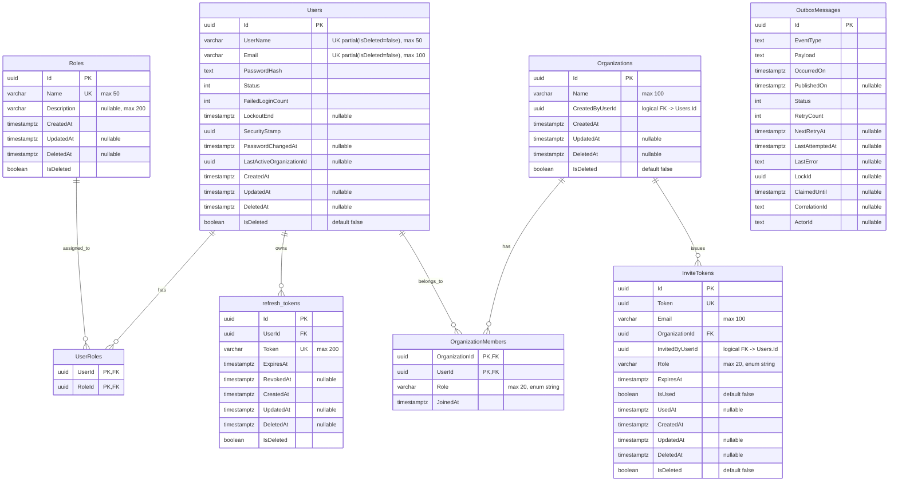
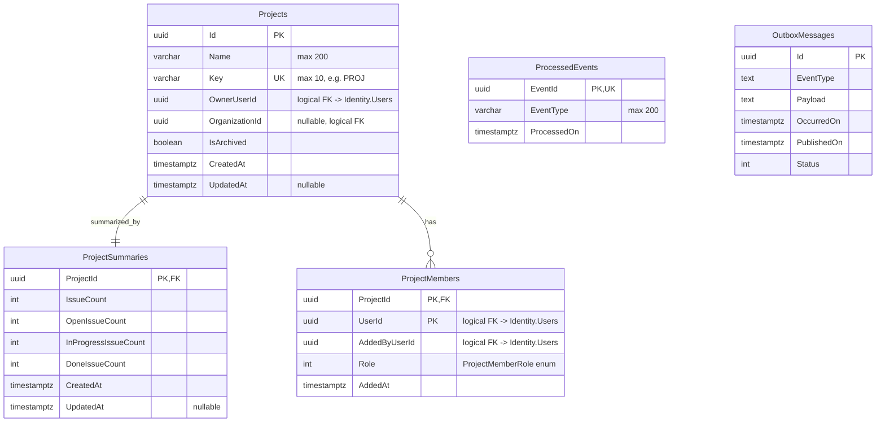
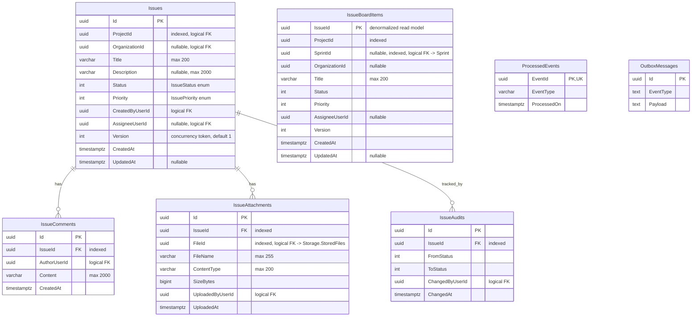
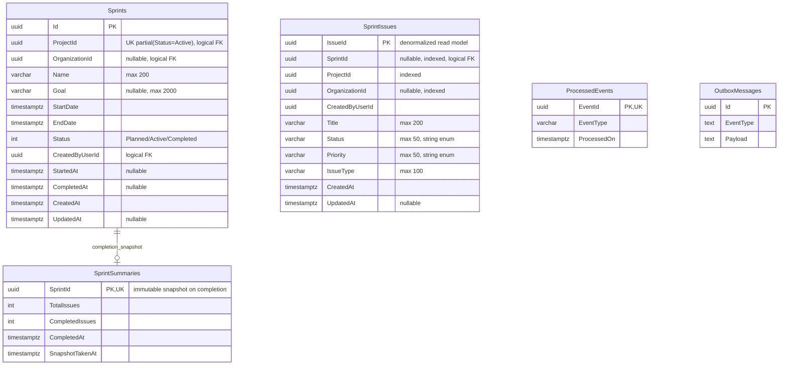
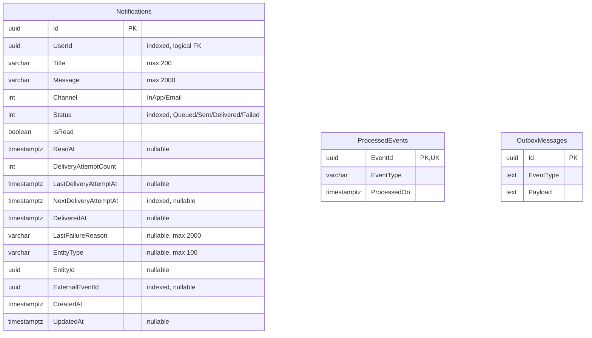
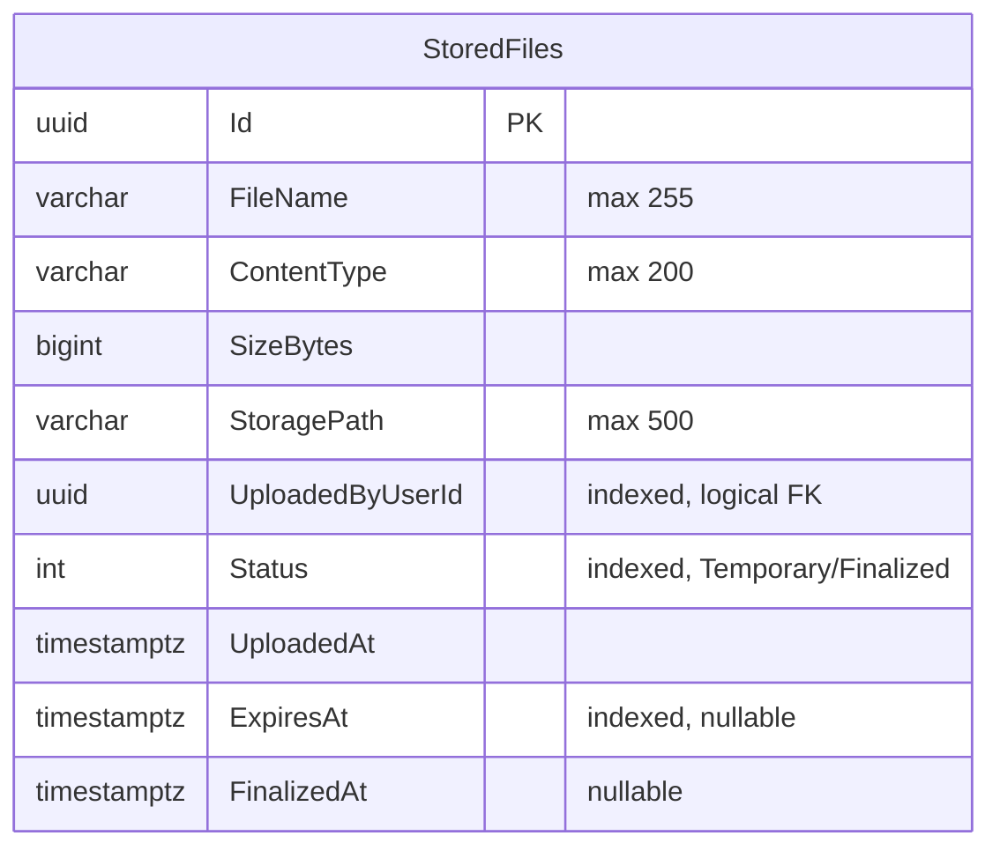
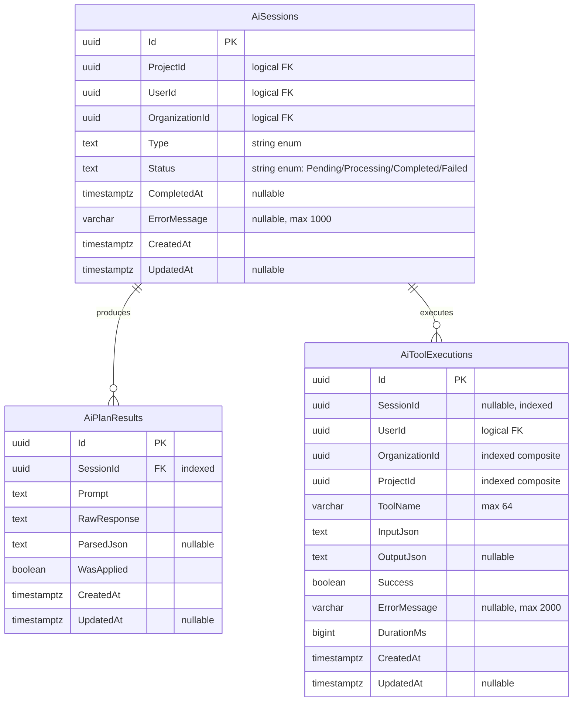
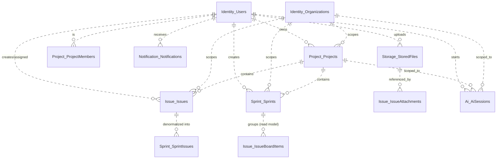

# ER Diyagramı — EF Core Migration Snapshot'larından

> **Kaynak:** Her servisin `*ModelSnapshot.cs` dosyaları (gerçek DB şeması).
> Bu dosya `er-diagram.md`'den daha **otoriter**dir; çünkü gerçek migration metadata'sından üretilmiştir.
> Read model'leri (CQRS), Outbox ve ProcessedEvents altyapı tablolarını da içerir.

## Render

```
mermaid.live → erDiagram bloğunu yapıştır → SVG indir
```

## Önemli Notlar

- **Servisler arası fiziksel FK YOKTUR.** `ProjectId`, `UserId`, `OrganizationId` gibi alanlar logical FK'dir (sadece UUID referansı).
- **Read model'ler** (`IssueBoardItem`, `SprintIssue`) CQRS pattern'inin write/read ayrımı için denormalize edilmiş tablolardır. Event'lerle güncellenir.
- **Outbox + ProcessedEvents** altyapı tablolarıdır (transactional outbox pattern, event idempotency).
- **Soft delete:** Identity entity'leri `IsDeleted` + `DeletedAt` alanlarına sahiptir; unique index'ler `IsDeleted=FALSE` filter'ı ile çalışır.

---

## 1. IdentityService DB



---

## 2. ProjectService DB



---

## 3. IssueService DB

> **CQRS:** `Issues` = write model (aggregate root), `IssueBoardItems` = read model (board görüntüsü için denormalize, `SprintId` içerir).



---

## 4. SprintService DB

> **İş kuralı:** `Sprints` üzerinde `(ProjectId)` unique partial index var, `Status=1 (Active)` filter'lı — bir projede **aynı anda yalnızca 1 aktif sprint** olabilir.



---

## 5. NotificationService DB



---

## 6. StorageService DB



---

## 7. AiService DB



---

## Cross-Service Logical FK Haritası

> Bu ilişkiler **veritabanı seviyesinde değil**, sadece UUID referansıyla mantıksal olarak vardır. Mikroservis bağımsızlığını korur.



---

## EFCorePowerTools ile Görsel Çıktı (Visual Studio)

Eğer Mermaid yerine **Visual Studio içinden** ER diyagramı çıkarmak istersen:

1. **EF Core Power Tools** eklentisini Visual Studio'ya yükle: VS → Extensions → Manage Extensions → "EF Core Power Tools" ara → Install
2. Solution Explorer'da her servisin `*.Infrastructure` projesine **sağ tık** → **EF Core Power Tools** → **Add DbContext Diagram**
3. Açılan pencerede DbContext'i seç → **OK** → `.dgml` dosyası oluşur
4. `.dgml` dosyasına çift tıkla → VS otomatik render eder → sağ tık **Save As Image** (PNG)

**7 servis için tekrarla:**
- IdentityService.Infrastructure
- ProjectService.Infrastructure
- IssueService.Infrastructure
- SprintService.Infrastructure
- NotificationService.Infrastructure
- StorageService.Infrastructure
- AiService.Infrastructure

Çıktılar `docs/erd/dgml/` klasörüne taşınabilir.
