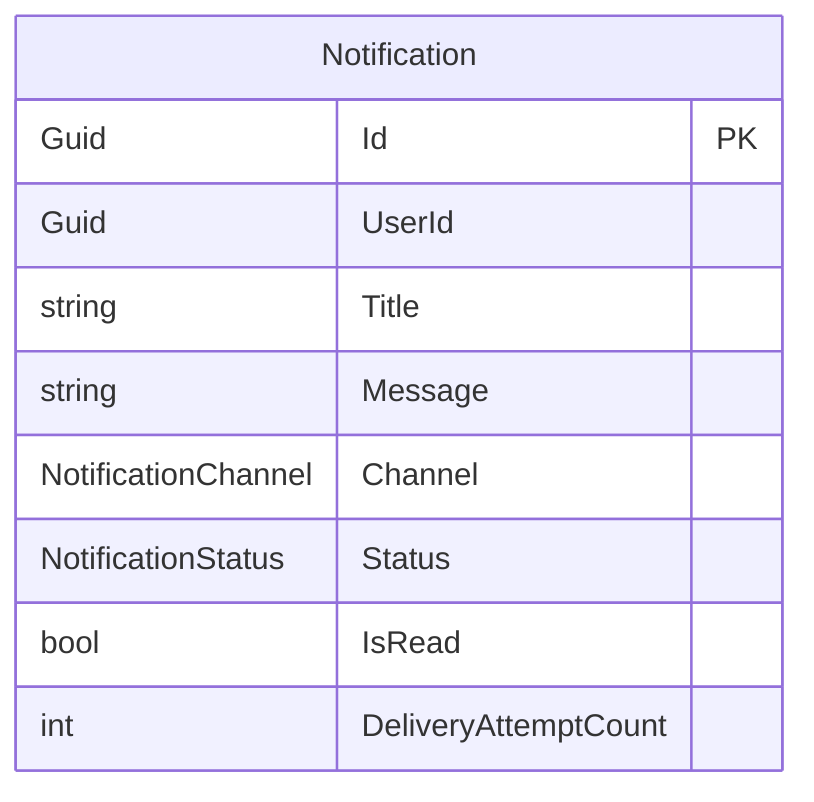
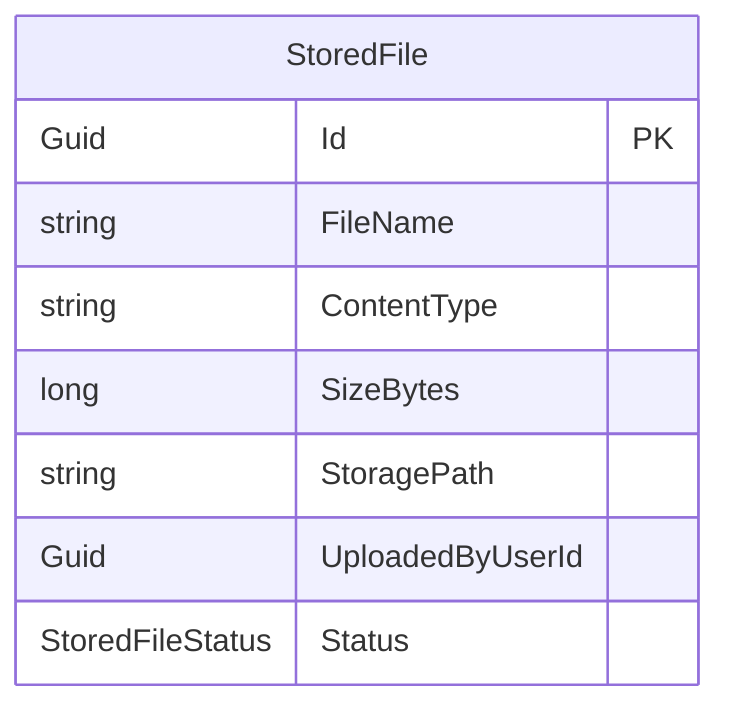

# ER Diyagramı — BitirmeProject

> Mikroservis mimarisi: her servisin kendi PostgreSQL veritabanı vardır.
> Servisler arası ilişkiler **logical FK** (kesik çizgi `..` ile) olarak gösterilmiştir —
> veritabanı seviyesinde foreign key yoktur, sadece ID referansıdır.

## Render

- [mermaid.live](https://mermaid.live) → kodu yapıştır → PNG/SVG indir
- VSCode: "Markdown Preview Mermaid Support" eklentisi
- Excalidraw: Mermaid → Excalidraw import (sketchy görünüm için)

---

## Tüm Sistem (Logical ER)

```mermaid
erDiagram

    %% ============ IDENTITY SERVICE ============
    User ||--o{ UserRole : "has"
    Role ||--o{ UserRole : "assigned_to"
    User ||--o{ RefreshToken : "owns"
    Organization ||--o{ OrganizationMember : "has"
    User ||--o{ OrganizationMember : "belongs_to"
    Organization ||--o{ InviteToken : "issues"
    User ||--o{ InviteToken : "invited_by"

    %% ============ PROJECT SERVICE ============
    Project ||--o{ ProjectMember : "has"
    Project ||--|| ProjectSummary : "summarized_by"

    %% ============ ISSUE SERVICE ============
    Issue ||--o{ IssueComment : "has"
    Issue ||--o{ IssueAttachment : "has"
    Issue ||--o{ IssueAudit : "tracked_by"

    %% ============ SPRINT SERVICE ============
    Sprint ||--o| SprintSummary : "snapshot"

    %% ============ AI SERVICE ============
    AiSession ||--o{ AiPlanResult : "produces"
    AiSession ||--o{ AiToolExecution : "executes"

    %% ============ CROSS-SERVICE LOGICAL FKs ============
    User ||..o{ Project : "owns"
    Organization ||..o{ Project : "scopes"
    User ||..o{ ProjectMember : "is"
    Project ||..o{ Issue : "contains"
    User ||..o{ Issue : "assigned/created"
    Organization ||..o{ Issue : "scopes"
    Project ||..o{ Sprint : "contains"
    User ||..o{ Sprint : "created_by"
    Organization ||..o{ Sprint : "scopes"
    User ||..o{ Notification : "receives"
    User ||..o{ StoredFile : "uploaded_by"
    StoredFile ||..o{ IssueAttachment : "referenced_by"
    User ||..o{ AiSession : "started_by"
    Project ||..o{ AiSession : "scoped_to"
    Organization ||..o{ AiSession : "scoped_to"

    User {
        Guid Id PK
        string UserName UK
        string Email UK
        string PasswordHash
        UserStatus Status
        int FailedLoginCount
        datetime LockoutEnd "nullable"
        Guid SecurityStamp
        datetime PasswordChangedAt "nullable"
        Guid LastActiveOrganizationId FK "nullable"
        datetime CreatedAt
        datetime UpdatedAt
        bool IsDeleted
    }

    Role {
        Guid Id PK
        string Name UK
        string Description "nullable"
        datetime CreatedAt
        datetime UpdatedAt
    }

    UserRole {
        Guid UserId PK,FK
        Guid RoleId PK,FK
    }

    RefreshToken {
        Guid Id PK
        Guid UserId FK
        string Token UK
        datetime ExpiresAt
        datetime RevokedAt "nullable"
        datetime CreatedAt
    }

    Organization {
        Guid Id PK
        string Name
        Guid CreatedByUserId FK
        datetime CreatedAt
        datetime UpdatedAt
        bool IsDeleted
    }

    OrganizationMember {
        Guid OrganizationId PK,FK
        Guid UserId PK,FK
        OrganizationRole Role
        datetime JoinedAt
    }

    InviteToken {
        Guid Id PK
        Guid Token UK
        string Email
        Guid OrganizationId FK
        Guid InvitedByUserId FK
        OrganizationRole Role
        datetime ExpiresAt
        bool IsUsed
        datetime UsedAt "nullable"
        bool IsDeleted
    }

    Project {
        Guid Id PK
        string Name
        string Key UK
        Guid OwnerUserId "logical FK -> User"
        Guid OrganizationId "logical FK, nullable"
        bool IsArchived
        datetime CreatedAt
        datetime UpdatedAt
    }

    ProjectMember {
        Guid ProjectId PK,FK
        Guid UserId PK "logical FK -> User"
        Guid AddedByUserId "logical FK -> User"
        ProjectMemberRole Role
        datetime AddedAt
    }

    ProjectSummary {
        Guid ProjectId PK,FK
        int IssueCount
        int OpenIssueCount
        int InProgressIssueCount
        int DoneIssueCount
        datetime CreatedAt
        datetime UpdatedAt "nullable"
    }

    Issue {
        Guid Id PK
        Guid ProjectId "logical FK -> Project"
        Guid OrganizationId "logical FK, nullable"
        string Title
        string Description "nullable"
        IssueStatus Status
        IssuePriority Priority
        Guid CreatedByUserId "logical FK -> User"
        Guid AssigneeUserId "logical FK, nullable"
        int Version
        datetime CreatedAt
        datetime UpdatedAt
    }

    IssueComment {
        Guid Id PK
        Guid IssueId FK
        Guid AuthorUserId "logical FK -> User"
        string Content
        datetime CreatedAt
    }

    IssueAttachment {
        Guid Id PK
        Guid IssueId FK
        Guid FileId "logical FK -> StoredFile"
        string FileName
        string ContentType
        long SizeBytes
        Guid UploadedByUserId "logical FK -> User"
        datetime UploadedAt
    }

    IssueAudit {
        Guid Id PK
        Guid IssueId FK
        IssueStatus FromStatus
        IssueStatus ToStatus
        Guid ChangedByUserId "logical FK -> User"
        datetime ChangedAt
    }

    Sprint {
        Guid Id PK
        Guid ProjectId "logical FK -> Project"
        Guid OrganizationId "logical FK, nullable"
        string Name
        string Goal "nullable"
        datetime StartDate
        datetime EndDate
        SprintStatus Status
        Guid CreatedByUserId "logical FK -> User"
        datetime StartedAt "nullable"
        datetime CompletedAt "nullable"
        datetime CreatedAt
        datetime UpdatedAt
    }

    SprintSummary {
        Guid SprintId PK,FK
        int TotalIssues
        int CompletedIssues
        datetime CompletedAt
        datetime SnapshotTakenAt
    }

    Notification {
        Guid Id PK
        Guid UserId "logical FK -> User"
        string Title
        string Message
        NotificationChannel Channel
        NotificationStatus Status
        bool IsRead
        datetime ReadAt "nullable"
        int DeliveryAttemptCount
        datetime LastDeliveryAttemptAt "nullable"
        datetime NextDeliveryAttemptAt "nullable"
        datetime DeliveredAt "nullable"
        string LastFailureReason "nullable"
        string EntityType "nullable"
        Guid EntityId "nullable"
        Guid ExternalEventId "nullable"
        datetime CreatedAt
        datetime UpdatedAt
    }

    StoredFile {
        Guid Id PK
        string FileName
        string ContentType
        long SizeBytes
        string StoragePath
        Guid UploadedByUserId "logical FK -> User"
        StoredFileStatus Status
        datetime UploadedAt
        datetime ExpiresAt "nullable"
        datetime FinalizedAt "nullable"
    }

    AiSession {
        Guid Id PK
        Guid ProjectId "logical FK -> Project"
        Guid UserId "logical FK -> User"
        Guid OrganizationId "logical FK -> Organization"
        AiSessionType Type
        AiSessionStatus Status
        datetime CompletedAt "nullable"
        string ErrorMessage "nullable"
        datetime CreatedAt
        datetime UpdatedAt
    }

    AiPlanResult {
        Guid Id PK
        Guid SessionId FK
        string Prompt
        string RawResponse
        string ParsedJson "nullable"
        bool WasApplied
        datetime CreatedAt
        datetime UpdatedAt
    }

    AiToolExecution {
        Guid Id PK
        Guid SessionId FK "nullable"
        Guid UserId "logical FK -> User"
        Guid OrganizationId "logical FK"
        Guid ProjectId "logical FK"
        string ToolName
        string InputJson
        string OutputJson "nullable"
        bool Success
        string ErrorMessage "nullable"
        long DurationMs
        datetime CreatedAt
    }
```



---

## Servis Bazlı Görünüm (poster için ayrı ayrı render edebilirsin)

### 1. IdentityService DB

```mermaid
erDiagram
    User ||--o{ UserRole : "has"
    Role ||--o{ UserRole : "assigned_to"
    User ||--o{ RefreshToken : "owns"
    Organization ||--o{ OrganizationMember : "has"
    User ||--o{ OrganizationMember : "belongs_to"
    Organization ||--o{ InviteToken : "issues"
    User ||--o{ InviteToken : "invited_by"

    User {
        Guid Id PK
        string UserName UK
        string Email UK
        string PasswordHash
        UserStatus Status
        int FailedLoginCount
        Guid SecurityStamp
        Guid LastActiveOrganizationId FK
    }
    Role { Guid Id PK; string Name UK }
    UserRole { Guid UserId PK,FK; Guid RoleId PK,FK }
    RefreshToken { Guid Id PK; Guid UserId FK; string Token UK; datetime ExpiresAt }
    Organization { Guid Id PK; string Name; Guid CreatedByUserId FK }
    OrganizationMember { Guid OrgId PK,FK; Guid UserId PK,FK; OrganizationRole Role }
    InviteToken { Guid Id PK; Guid OrganizationId FK; Guid InvitedByUserId FK; string Email; OrganizationRole Role; datetime ExpiresAt; bool IsUsed }
```

### 2. ProjectService DB

```mermaid
erDiagram
    Project ||--o{ ProjectMember : "has"
    Project ||--|| ProjectSummary : "summarized_by"

    Project { Guid Id PK; string Name; string Key UK; Guid OwnerUserId; Guid OrganizationId; bool IsArchived }
    ProjectMember { Guid ProjectId PK,FK; Guid UserId PK; Guid AddedByUserId; ProjectMemberRole Role }
    ProjectSummary { Guid ProjectId PK,FK; int IssueCount; int OpenIssueCount; int InProgressIssueCount; int DoneIssueCount }
```

### 3. IssueService DB

```mermaid
erDiagram
    Issue ||--o{ IssueComment : "has"
    Issue ||--o{ IssueAttachment : "has"
    Issue ||--o{ IssueAudit : "tracked_by"

    Issue { Guid Id PK; Guid ProjectId; Guid OrganizationId; string Title; IssueStatus Status; IssuePriority Priority; Guid CreatedByUserId; Guid AssigneeUserId }
    IssueComment { Guid Id PK; Guid IssueId FK; Guid AuthorUserId; string Content }
    IssueAttachment { Guid Id PK; Guid IssueId FK; Guid FileId; string FileName; long SizeBytes }
    IssueAudit { Guid Id PK; Guid IssueId FK; IssueStatus FromStatus; IssueStatus ToStatus; Guid ChangedByUserId }
```

### 4. SprintService DB

```mermaid
erDiagram
    Sprint ||--o| SprintSummary : "snapshot"

    Sprint { Guid Id PK; Guid ProjectId; Guid OrganizationId; string Name; datetime StartDate; datetime EndDate; SprintStatus Status }
    SprintSummary { Guid SprintId PK,FK; int TotalIssues; int CompletedIssues; datetime CompletedAt }
```

### 5. NotificationService DB



### 6. StorageService DB



### 7. AiService DB

```mermaid
erDiagram
    AiSession ||--o{ AiPlanResult : "produces"
    AiSession ||--o{ AiToolExecution : "executes"

    AiSession { Guid Id PK; Guid ProjectId; Guid UserId; Guid OrganizationId; AiSessionType Type; AiSessionStatus Status }
    AiPlanResult { Guid Id PK; Guid SessionId FK; string Prompt; string RawResponse; bool WasApplied }
    AiToolExecution { Guid Id PK; Guid SessionId FK; Guid UserId; Guid ProjectId; string ToolName; bool Success; long DurationMs }
```
