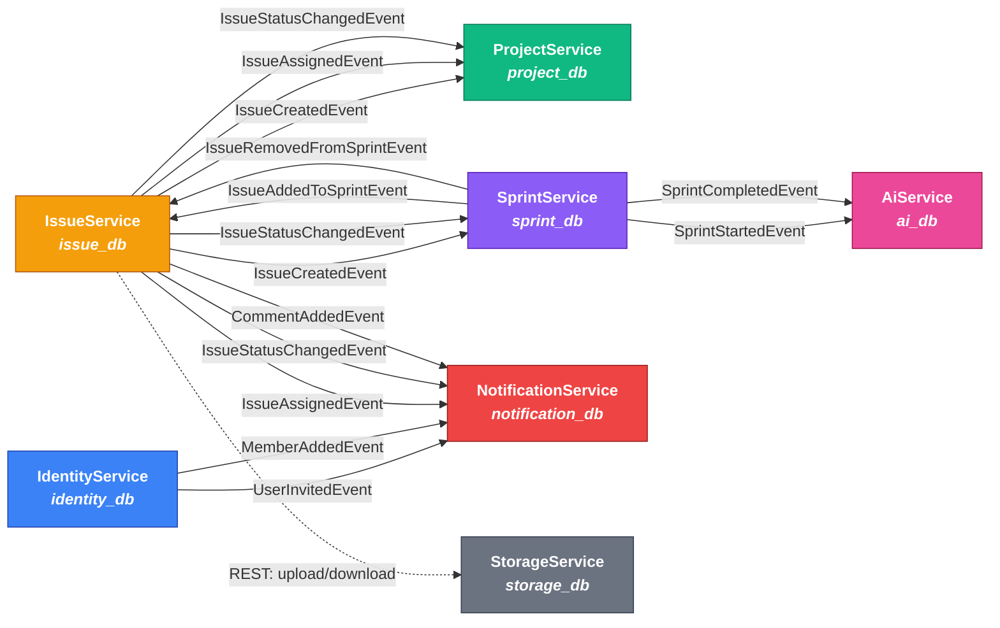
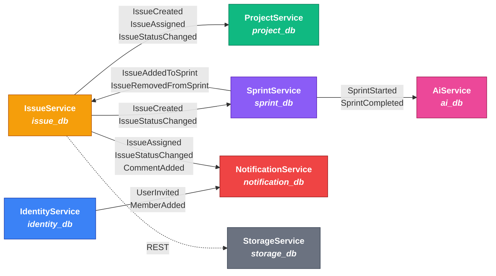

# Servisler Arası Event Akışı (Mermaid)

> mermaid.live için. Aşağıdaki blokların **birini** seç, kopyala, mermaid.live'a yapıştır.

---

## Versiyon 1 — Renkli, yatay (önerilen, poster için)

---

## Versiyon 2 — Sadeleştirilmiş (event'ler gruplanmış, daha az çizgi)

---

## Versiyon 3 — Tam mimari: Frontend + Gateway + BFF + Servisler + Outbox + RabbitMQ

> **Outbox pattern:** Her publishing servisi event'i kendi DB'sindeki `OutboxMessages` tablosuna iş verisiyle aynı transaction içinde yazar.
> `OutboxPublisherService` (her serviste host edilen BackgroundService) bu tabloyu poll eder ve RabbitMQ'ya iletir — event delivery garantisi sağlar.
>
> **A0 poster için optimize edilmiş:** büyük font, geniş node aralığı. SVG export et, Illustrator/Photoshop'ta vector olarak ölçekle (kalite kaybı yok).

```mermaid
%%{init: {
  'theme': 'base',
  'themeVariables': {
    'fontSize': '22px',
    'fontFamily': 'Segoe UI, Arial, sans-serif',
    'edgeLabelBackground': '#FFFFFF',
    'lineColor': '#374151'
  },
  'flowchart': {
    'nodeSpacing': 80,
    'rankSpacing': 110,
    'curve': 'basis',
    'padding': 20,
    'useMaxWidth': false
  }
}}%%
flowchart LR
    Frontend["<b>Frontend</b><br/><i>React Web (Vite)</i>"]:::frontend
    Gateway["<b>ApiGateway</b><br/><i>YARP Reverse Proxy</i>"]:::gateway
    BFF["<b>BFF</b><br/><i>Bff.Api</i>"]:::bff

    Identity["<b>IdentityService</b><br/><i>identity_db</i>"]:::identity
    Project["<b>ProjectService</b><br/><i>project_db</i>"]:::project
    Issue["<b>IssueService</b><br/><i>issue_db</i>"]:::issue
    Sprint["<b>SprintService</b><br/><i>sprint_db</i>"]:::sprint
    Notification["<b>NotificationService</b><br/><i>notification_db</i>"]:::notification
    Storage["<b>StorageService</b><br/><i>storage_db</i>"]:::storage
    AI["<b>AiService</b><br/><i>ai_db</i>"]:::ai

    IdentityOB[("Outbox<br/><i>identity_db</i>")]:::outbox
    IssueOB[("Outbox<br/><i>issue_db</i>")]:::outbox
    SprintOB[("Outbox<br/><i>sprint_db</i>")]:::outbox

    IdentityPub(["OutboxPublisher<br/><i>BackgroundService</i>"]):::publisher
    IssuePub(["OutboxPublisher<br/><i>BackgroundService</i>"]):::publisher
    SprintPub(["OutboxPublisher<br/><i>BackgroundService</i>"]):::publisher

    MQ{{"<b>RabbitMQ</b><br/>Event Bus"}}:::broker

    %% --- Client ↔ Edge ---
    Frontend -->|HTTPS REST| Gateway
    Frontend -->|Aggregated Queries| BFF
    Notification -.->|SignalR push| Frontend

    %% --- Gateway routing ---
    Gateway -->|/auth /users /orgs| Identity
    Gateway -->|/projects| Project
    Gateway -->|/issues| Issue
    Gateway -->|/sprints| Sprint
    Gateway -->|/notifications| Notification
    Gateway -->|/storage| Storage
    Gateway -->|/ai| AI

    %% --- BFF aggregation ---
    BFF -->|REST| Identity
    BFF -->|REST| Project
    BFF -->|REST| Issue
    BFF -->|REST| Sprint
    BFF -->|REST| Notification

    %% --- Outbox write (transactional) ---
    Identity ==>|"tx write"| IdentityOB
    Issue ==>|"tx write"| IssueOB
    Sprint ==>|"tx write"| SprintOB

    %% --- Outbox poll & publish ---
    IdentityOB -->|poll| IdentityPub
    IssueOB -->|poll| IssuePub
    SprintOB -->|poll| SprintPub

    IdentityPub -->|"UserInvited<br/>MemberAdded"| MQ
    IssuePub -->|"IssueCreated / IssueAssigned<br/>IssueStatusChanged / CommentAdded"| MQ
    SprintPub -->|"SprintStarted / SprintCompleted<br/>IssueAddedToSprint / IssueRemovedFromSprint"| MQ

    %% --- Event consumers ---
    MQ -->|"UserInvited / MemberAdded<br/>IssueAssigned / IssueStatusChanged<br/>CommentAdded"| Notification
    MQ -->|"IssueCreated / IssueAssigned<br/>IssueStatusChanged"| Project
    MQ -->|"IssueCreated / IssueStatusChanged"| Sprint
    MQ -->|"IssueAddedToSprint<br/>IssueRemovedFromSprint"| Issue
    MQ -->|"SprintStarted / SprintCompleted"| AI

    %% --- Direct REST (event olmayan) ---
    Issue -.->|REST upload/download| Storage

    classDef frontend fill:#0EA5E9,stroke:#0369A1,color:#fff,font-weight:bold,font-size:24px,stroke-width:3px
    classDef gateway fill:#14B8A6,stroke:#115E59,color:#fff,font-weight:bold,font-size:24px,stroke-width:3px
    classDef bff fill:#A855F7,stroke:#6B21A8,color:#fff,font-weight:bold,font-size:24px,stroke-width:3px
    classDef identity fill:#3B82F6,stroke:#1E40AF,color:#fff,font-weight:bold,font-size:24px,stroke-width:3px
    classDef project fill:#10B981,stroke:#047857,color:#fff,font-weight:bold,font-size:24px,stroke-width:3px
    classDef issue fill:#F59E0B,stroke:#B45309,color:#fff,font-weight:bold,font-size:24px,stroke-width:3px
    classDef sprint fill:#8B5CF6,stroke:#5B21B6,color:#fff,font-weight:bold,font-size:24px,stroke-width:3px
    classDef notification fill:#EF4444,stroke:#991B1B,color:#fff,font-weight:bold,font-size:24px,stroke-width:3px
    classDef storage fill:#6B7280,stroke:#374151,color:#fff,font-weight:bold,font-size:24px,stroke-width:3px
    classDef ai fill:#EC4899,stroke:#9D174D,color:#fff,font-weight:bold,font-size:24px,stroke-width:3px
    classDef broker fill:#FB923C,stroke:#9A3412,color:#fff,font-weight:bold,font-size:26px,stroke-width:3px
    classDef outbox fill:#FEF3C7,stroke:#92400E,color:#78350F,font-weight:bold,font-size:22px,stroke-width:3px
    classDef publisher fill:#FDE68A,stroke:#92400E,color:#78350F,font-style:italic,font-size:22px,stroke-width:3px

    linkStyle default stroke-width:2.5px,font-size:18px
```

